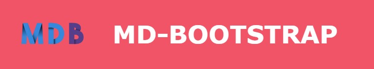
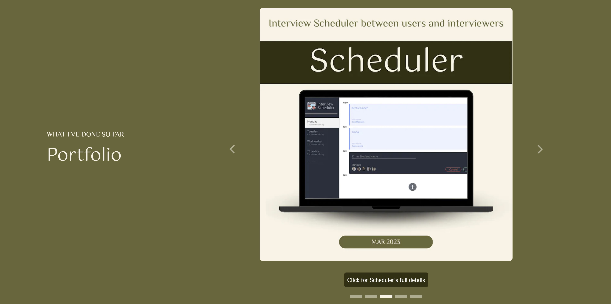
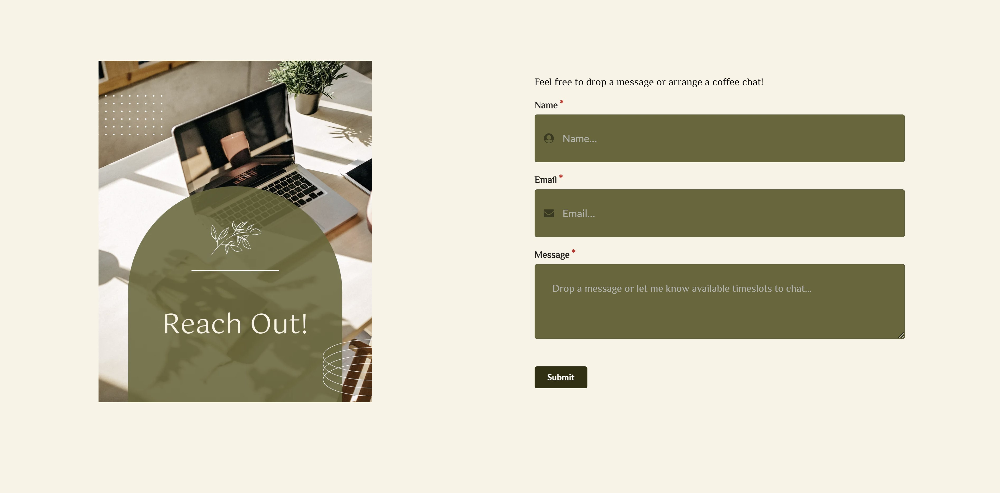

# 
# PROJECT TITLE - KHIN MO MO ZIN Portfolio

## PROJECT DESCRIPTION

A responsive web app to introduce about myself and showcase my skills and projects.


# TECH STACK #

## Languages, Frameworks & Database ##


## External Libraries ##
<div style="display: flex; margin-bottom:15px">



</div>

## Others


# PROJECT OVERVIEW #








# PROJECT SETUP #

## INITIAL SETUP
```
cd portfolio/mo-portfolio
npm install
```

## START DEVELOPMENT SERVER

```
npm run dev
# or
yarn dev
# or
pnpm dev
```

### Open [http://localhost:3000](http://localhost:3000) with your browser to see the result.


